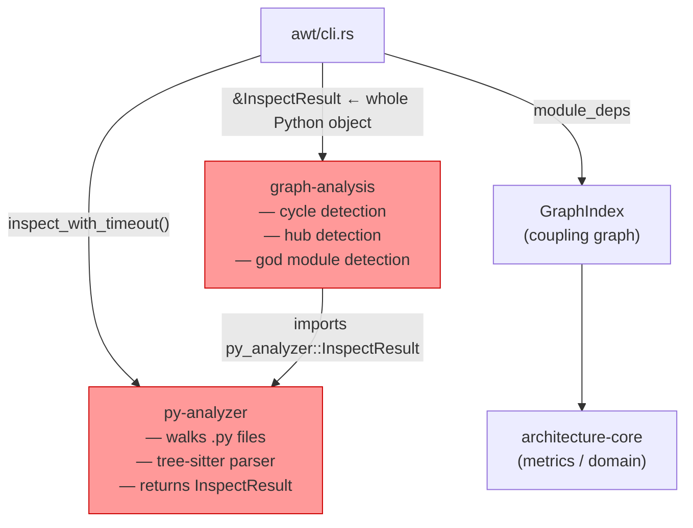
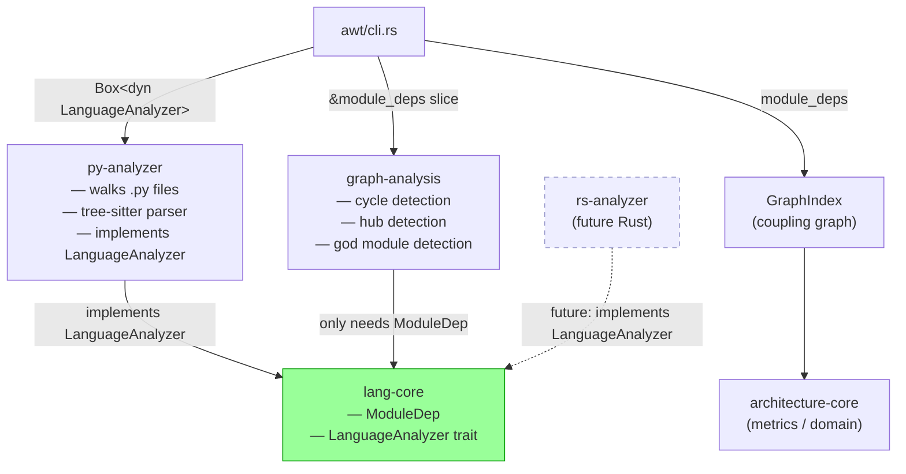

# Language Adapter

## The Problem

`graph-analysis` (the crate that detects cycles, hubs, and god modules) was directly importing Python-specific code. It only ever needed two strings — `from` and `to` (module A imports module B) — but it was forced to take a `py_analyzer::InspectResult` to get them.

That meant: to add Rust analysis, you'd have to touch the violation detector. That's wrong. Cycles are cycles in any language.

---

## The Fix: `lang-core`

A new crate owns the two things every language analyzer must produce:

**1. `ModuleDep`** — the only data structure the violation detector needs:

```text
{ from: "domain.order", to: "domain.billing" }
```

**2. `LanguageAnalyzer`** — the interface (Rust calls it a trait) every language must implement:

```rust
pub trait LanguageAnalyzer {
    fn module_deps(&self, path: &Path) -> Result<Vec<ModuleDep>, _>;
}
```

`PythonAnalyzer` implements it today. `RustAnalyzer` will implement it next — and nothing else changes.

---

## Before



`graph-analysis` imports from `py-analyzer`. They are coupled.

---

## After



`graph-analysis` no longer knows Python exists. `rs-analyzer` is a new crate — nothing else needs touching.

---

## What Changed (Round 1 — the seam)

| | Before | After |
| --- | --- | --- |
| `graph-analysis` imports | `py_analyzer::InspectResult` | `lang_core::ModuleDep` |
| `analyze()` takes | `&InspectResult` (Python type) | `&[ModuleDep]` (language-agnostic) |
| `ModuleDep` defined in | `py-analyzer` | `lang-core` (re-exported by py-analyzer) |
| To add Rust analysis | Must touch graph-analysis | New `rs-analyzer` crate only |

---

## What Changed (Round 2 — making the seam usable)

Round 1 created the interface but nothing actually used it yet. The CLI was still calling Python code directly, and the interface itself had a technical flaw that prevented it from being used at runtime. Round 2 fixed both.

**Problem 1: the interface wasn't plugged in.**

The CLI (`cli.rs`) was still calling `py_analyzer::inspect_with_timeout()` by name — hardwired to Python. The interface existed on paper but was bypassed in practice. Adding Rust would have meant editing `cli.rs` directly.

Fix: the CLI now asks for a `--language` flag (default: `python`) and routes through the interface:

```rust
let analyzer: Box<dyn LanguageAnalyzer> = match args.language {
    Language::Python => Box::new(py_analyzer::PythonAnalyzer),
    // Language::Rust => Box::new(rs_analyzer::RustAnalyzer),  ← future
};
```

Adding Rust is now: add one line to that match. Nothing else changes.

**Problem 2: the interface couldn't be used at runtime.**

In Rust, to swap implementations at runtime you need a "trait object" — essentially a pointer to whichever implementation was chosen. The original interface had an associated error type (`type Error = ...`) which made this impossible: Rust can't build a trait object when each implementation returns a different error type.

Fix: the interface now boxes its error instead of naming it:

```rust
fn module_deps(&self, path: &Path)
    -> Result<Vec<ModuleDep>, Box<dyn Error + Send + Sync>>
```

Every implementation wraps its own error in the box. The caller doesn't need to know what's inside.

| | Before | After |
| --- | --- | --- |
| CLI dispatches through | `py_analyzer::inspect_with_timeout()` directly | `Box<dyn LanguageAnalyzer>` via `--language` flag |
| Trait usable at runtime | No — associated error type blocked it | Yes — error is boxed |
| Adding `rs-analyzer` to CLI | Edit `cli.rs` logic | Add one match arm |
